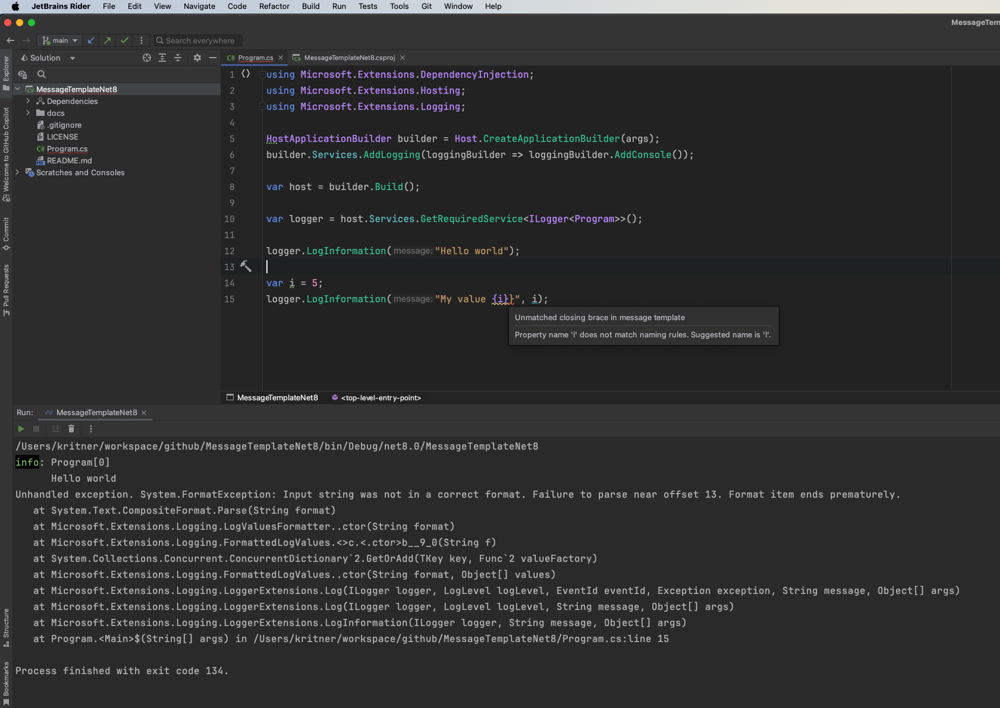

# MessageTemplateNet8

Rider is thankfully warning me about the issue in this message template string, however this shouldn't be a Rider warning, this should be an actual warning (dare I say even error) since it immediately leads to a runtime error.

This is new behavior in .net8, this did not happen in .net7.

Since the issue is hard to detect (since it successfully compiles) I feel like this necessitates at a minimum a warning, ideally a compiler error.

This does not seem to be covered under CA2017
